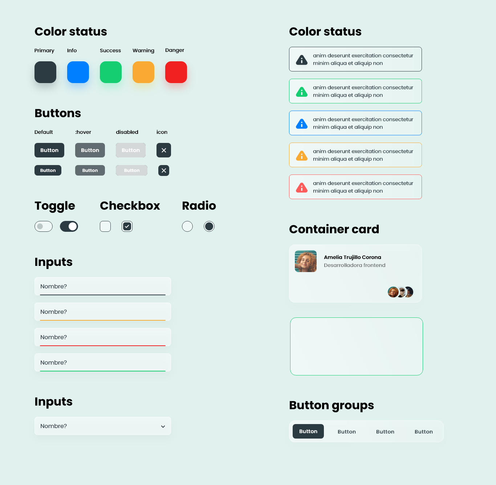

# Formilk (...Project in progress)


<br/>

Design system created by UpperCod with the aim of achieving a unique aesthetic that subtly mixes solids, gradients and shadows. formilk was created to be used without complexity and interaction limitations.



```js
import { c, html, css } from "atomico";

function component() {
    return html`<host></host>`;
}

component.styles = loadTokens(css`
    :host {
        visible: hidden;
    }
`);

function loadTokens(css) {
    // Recuperamos nuestros tokens externos
    fetch("/my-api-tokens")
        .then((res) => res.json())
        .then(
            // Serialización los tokens como custom Properties.
            (tokens) =>
                `:host{${Object.entries(tokens)
                    .map(([name, value]) => `--${name}: ${value};`)
                    .join("")}}`
        )
        // css.replace, permite reemplazar el css asociado al componente de forma asincrona
        .then((nextCss) => css.replace(nextCss));

    return css;
}
```
