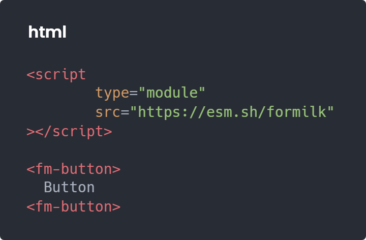
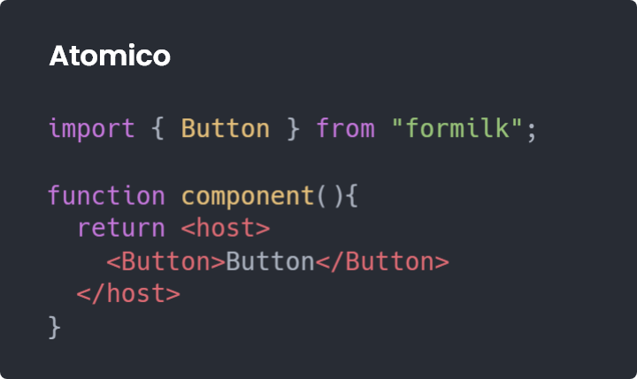

  

Formilk is a system of configurable webcomponents designed by [UpperCod](https://twitter.com/uppercod) and created with [Atomico](http://github.com/atomicojs/atomico), Formilk is created to:

1. offer a series of useful webcomponents when creating design systems.
2. Configurable through a token system represented by custom properties.
3. Be agnostically friendly with third party libraries, eg Html, React, Preact and others.
4. Communicate states to forms, Whether formilk webcomponents can be used inside a `<form>` tag.

## Usage example

## Figma preview

## Formilk is agnostically friendly

Thanks to Atomico formilk natively transcends React in the use of webcomponents, example:

## Contribute and share

We invite you to be part of this project, proposing new components and examples, for this we invite you to work with figma and then share your constructions with us.
