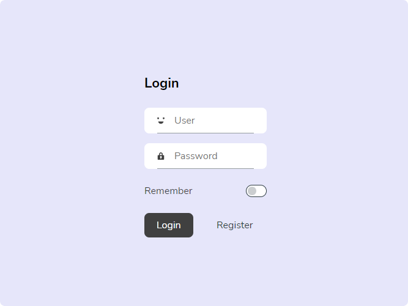

# Formilk (...Project in progress)

Design system created by UpperCod with the aim of achieving a unique aesthetic. Formilk was created to be used without complexity and interaction limitations.

## Kits

1. [Adobe XD](./formilk-ui.xd)

## Preview

## Contribute

Formilk seeks to be an extensible and utilitarian design system, I invite you to contribute with your vision of component design or development, you can leave an issue or comment via [Discord](https://discord.gg/7z3rNhmkNE)
